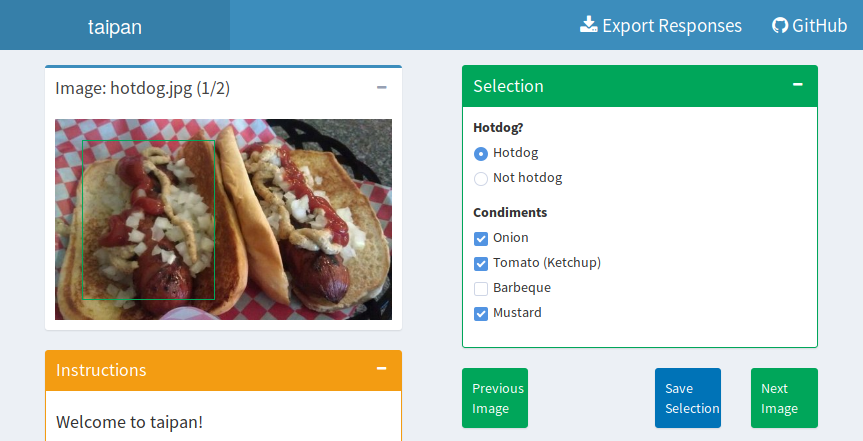

<!-- README.md is generated from README.Rmd. Please edit that file -->

```{r, echo = FALSE}
knitr::opts_chunk$set(
  collapse = TRUE,
  comment = "#>",
  fig.path = "README-"
)
```

# Taipan 

[](https://travis-ci.org/srkobakian/taipan)
[](https://cran.r-project.org/package=taipan)
[](https://cran.r-project.org/package=taipan)

Taipan is a Tool for Annotating Images in Preparation for ANalysis.

The Taipan package creates simple shiny surveys. The web applications can be used locally or deployed and allow people to save survey results as tidy data that is ready to use for analysis.

The app was initially created to streamline the process of manually tagging images to create a training set. 
It allows users to provide information regarding entire images, and smaller regions within. It is a survey style tool, with questions being posed for each image and area identified.


## Installation
You can install the **stable** version from [CRAN](https://cran.r-project.org/package=taipan).

```{r, eval = FALSE}
install.packages('taipan')
```

You can install the development version from Github using:

```{r, eval = FALSE}
# install.packages("devtools")
devtools::install_github("srkobakian/taipan")
```

## Usage

Taipan builds a shiny app suitable for annotating images. Questions can be provided for two scenarios in the app: 'scene' and 'selection'. Scene questions are suitable for questions that apply to the whole image, and are shown when no selection is made. Selection questions are appropriate for selected areas of the image, and are shown when a selection is made.

These lists of questions can be flexibly produced using the `taipanQuestions` function, where any shiny inputs and web elements can be used to build your own survey UI. For example, to train a model for identifying hotdogs and condiments, you could use this interface:

```{r, eval = FALSE}
library(taipan)
library(shiny)
questions <- taipanQuestions(
  scene = sliderInput("quality", label = "Image Quality",
                      min = 0, max = 10, value = 5),
  selection = div(
    radioButtons("hotdog", label = "Hotdog?",
                 choices = list("Hotdog", "Not hotdog")),
    checkboxGroupInput("extra", label = "Condiments",
                       choices = list("Onion", "Tomato (Ketchup)", "Barbeque", "Mustard"))
  )
)
```

To build a taipan app with these questions, we can use the `buildTaipan` function and provide a set of images to annotate. These images can be provided locally, or via links to the web. You can specify where the app will be created with the `appdir` argument.

```{r, eval = FALSE}
buildTaipan(
  questions = questions,
  images = c("https://raw.githubusercontent.com/srkobakian/taipan/master/sample_images/hotdog.jpg",
             "https://raw.githubusercontent.com/srkobakian/taipan/master/sample_images/not_hotdog.jpg"),
  appdir = file.path(tempdir(), "taipan"), overwrite = TRUE
)
```



