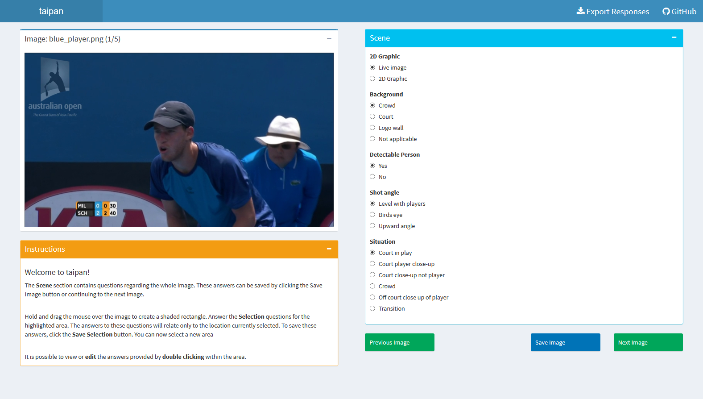
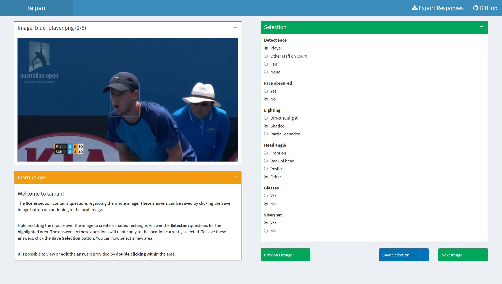
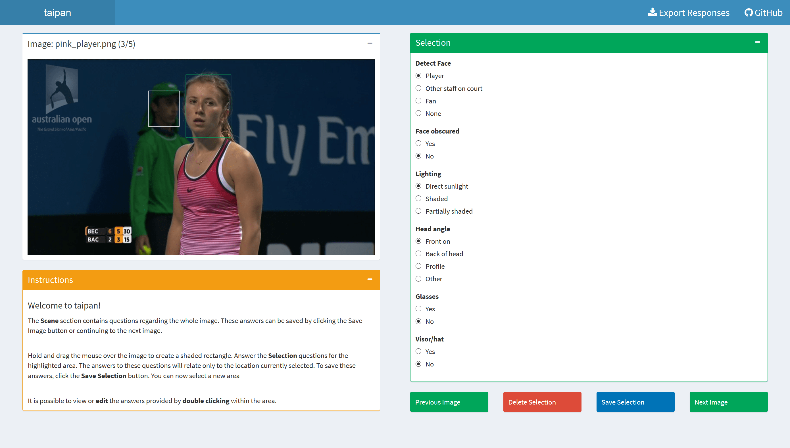

```{r setup, include = FALSE}
knitr::opts_chunk$set(
  collapse = TRUE,
  comment = "#>",
  fig.align = "centre",
  eval = TRUE,
  echo = TRUE,
  out.width=700)
library(taipan)
```

The Taipan package is a tool that can be used to create [Shiny](https://shiny.rstudio.com/) surveys.
The Shiny web applications can be run locally and allow users to export the survey results in a tidy data format, that is ready to use for analysis.

The app was initially created to streamline the process of manually tagging images to create a training set describing each image.
It allows users to provide information regarding entire images, and smaller regions within.
It is an interactive survey tool, with questions displayed for each image and area identified.


# Installation

You can install the development version from Github using:

```{r, eval = FALSE}
# install.packages("devtools")
devtools::install_github("srkobakian/taipan")
```

# Usage


### Example Images
 A folder has been provided in this package called `sample_images`. It contains five sample of images provided by Tennis Australia, they depict scenes from the Channel 7 broadcast of the Australian Open 2016. 

## Creating your app

 The following code creates the app that was used to tag images from the Australian Open in 2016.
 
 First load taipan, and shiny.
 
```{r packages}
# load packages
library(shiny)
library(taipan)
```

### Create questions

The survey creator provides questions using [Shiny widgets](https://shiny.rstudio.com/tutorial/written-tutorial/lesson3/), and the tutorials expand on the types of widgets you can use to collect information from users. Radio button widgets are used in the sample app, as all questions required one answer, and were limited to one answer.

Two sets of questions are required, one set that relates to the entire scene, and another set that relates to the smaller areas that can be selected in the images.

The following code shows the basic layout to include questions.

```
questions <- taipanQuestions(
  scene = div(),
  selection = div())
```

The following code creates the `taipanQuestions` set for the tennis images:

```{r questions}
# create questions to ask users
questions <- taipanQuestions(
  scene = div(radioButtons("graphic", label = ("2D Graphic"),
                           choices = list("Live image", "2D Graphic")),
              radioButtons("bg", label = ("Background"),
                           choices = list("Crowd",
                                          "Court", "Logo wall", "Not applicable")),
              radioButtons("person", label = ("Detectable Person"),
                           choices = list("Yes", "No"), selected = "Yes"),
              radioButtons("shotangle", label = ("Shot angle"),
                           choices = list("Level with players",
                                          "Birds eye",
                                          "Upward angle")),
              radioButtons("situation", label = ("Situation"),
                           choices = list("Court in play",
                                          "Court player close-up",
                                          "Court close-up not player",
                                          "Crowd",
                                          "Off court close up of player",
                                          "Transition"))),
  selection = div(radioButtons("detect", label = ("Detect Face"),
                               choices = list("Player" ,
                                              "Other staff on court", "Fan", "None")),
                  radioButtons("obscured", label = ("Face obscured"),
                               choices = list("Yes", "No"), selected = "No"),
                  radioButtons("lighting", label = ("Lighting"),
                               choices = list("Direct sunlight", "Shaded", "Partially shaded")),
                  radioButtons("headangle", label = ("Head angle"),
                               choices = list("Front on", "Back of head",
                                              "Profile", "Other")),
                  radioButtons("glasses", label = ("Glasses"),
                               choices = list("Yes", "No"), selected = "No"),
                  radioButtons("visorhat", label = ("Visor/hat"),
                               choices = list("Yes", "No")))
)

```


### Build app

To build the shiny app the following `buildTaipan` function is used.
It requires the taipanQuestions, the location to the save the new app, and the location of images. Images can be accessed via a URL, or a file path is held locally. Note that these images will be downloaded or copied to the directory of the new app.

```{r build, eval = FALSE}
images <-
  c("https://raw.githubusercontent.com/srkob1/taipan/master/sample_images/blue_player.png",
  "https://raw.githubusercontent.com/srkob1/taipan/master/sample_images/pink_player.png",
  "https://raw.githubusercontent.com/srkob1/taipan/master/sample_images/red_player.png",
  "https://raw.githubusercontent.com/srkob1/taipan/master/sample_images/yellow_player.png",
  "https://raw.githubusercontent.com/srkob1/taipan/master/sample_images/disgruntled_player.png")


buildTaipan(
  questions = questions,
  images = images,
  file.path(tempdir(), "taipan")
)
```

The sample app is stored in a temporary directory.
It will launch after it has been created, this default behaviour can be changed by setting `launch = FALSE`.

## Using the app

### Annotating Images
The `scene` questions need to be answered only once per image.
These questions appear for the first image when the app begins, and will be displayed as long as there is no area selected.

```{r echo=FALSE, dpi=150, fig.cap="Taipan application scene questions."}

```

### Selecting areas

The `selection` questions are answered for each highlighted area. To make a selection, click on the image and drag the mouse to create a shaded box covering the desired area.
When the area is selected, the `selection` questions become available. 


```{r echo=FALSE, dpi=150, fig.cap="Taipan application selection questions appear when selecting an area."}

```

When a user is finished answering questions for ALL selections in an image, click the `Next Image` button to continue to the next image available. A user can also choose the `Export responses` button at any time, downloading and saving all current information as a text file.

### Saving answers

When the questions for an area have been answered, the user should click the `Save Selection` button, this will save the current answers as information for the currently shaded area of the image.
Users can repeat the process of highlighting an area, answering and savings related questions as many times as needed.


```{r echo=FALSE, dpi=150, fig.cap="Taipan application selection questions can be answered for multiple selections."}

```


### Exporting answers

While the answers provided are regularly saved, they are not exported unless the `Export responses` button is used. This will save the comma separated values in the chosen directory. 

The answers are provided in a tidy format.
Each row contains one observation, we consider each selected area in an image an observation.
The columns contain information regarding each selected area. This includes:

- The file name of the image, labelled image_name
- The answer to each scene question, labelled as per the input id
- The bounding coordinates of the location, labelled xmin, xmax, ymin, ymax
- The answer to each selection question, labelled as per the input id

```{r preview_data, echo = TRUE}
taipan_export_2018_09_04 <- read.csv("taipan-export-2018-09-04.csv")
taipan_export_2018_09_04
```


### Editing results

It is possible to view and edit answers for a selected area by double clicking within the box shown on the image. 


```{r echo=FALSE, dpi=150, fig.cap="Taipan application selection answers can be viewed and edited by double clicking within an area."}

```

Saving the new answers for this selection will replace the previous answers, if the answers are not saved or deleted they will remain unchanged in the data set.

