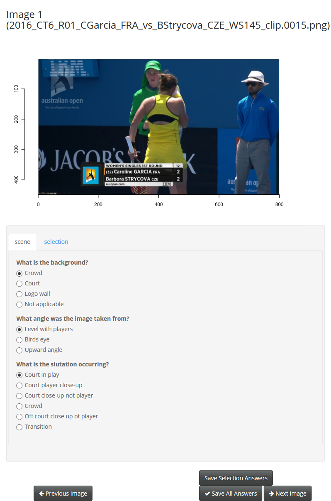
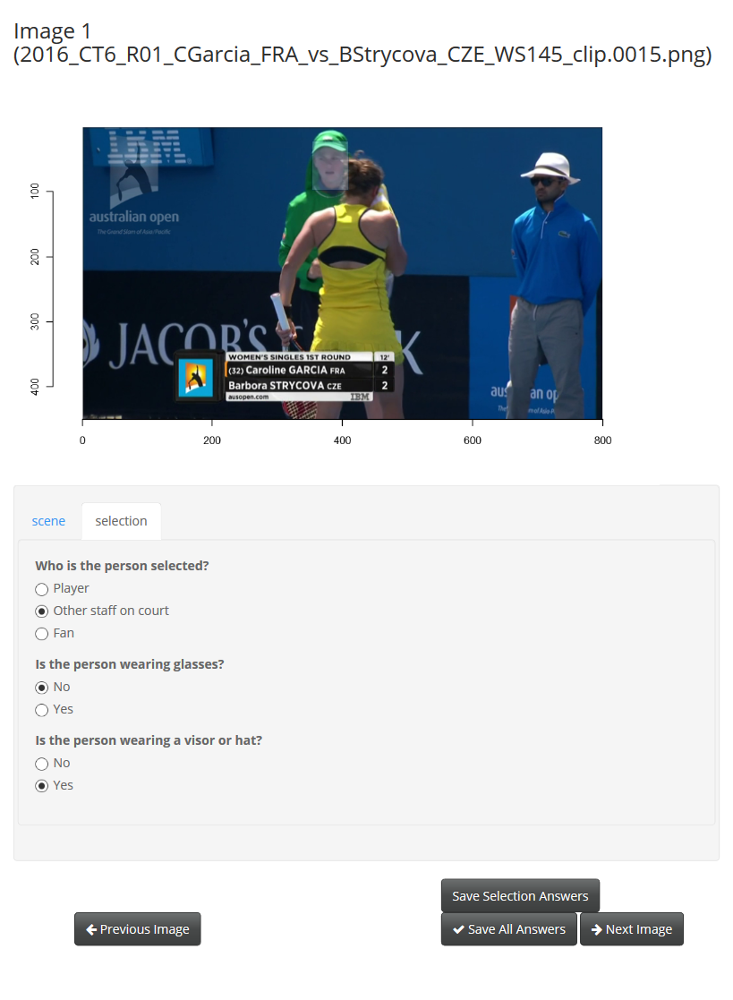

```{r setup, include = FALSE}
knitr::opts_chunk$set(
  collapse = TRUE,
  comment = "#>",
  cache = TRUE)
library(readr)
library(tidyverse)
```

The taipan web application was created to streamline the process of manually tagging images to create a training set. It results in a tidy data structure that is ready to use for analysis.
It allows user to provide information regarding entire images, and smaller regions within. It is a survey style tool, with questions being posed for each area identified.


## Installation

You can install the development version from Github using:

```{r, eval = FALSE}
# install.packages("devtools")
devtools::install_github("srkob1/taipan")
```

The Taipan app has been designed to run locally with images stored within the working directory.


## Usage


### Images
 To provide images for the users to annotate, create a directory for all images in a folder called `images`. Currently held A sample of images have been provided, these were provided by Tennis Australia, they depict scenes from the Channel 7 broadcast of the Australian Open 2016.

### Questions
 The question lists should be provided in the style of the sample question list. Each question requires the choices available, the question type and whether there should be a specific default answer.


### Launch the Shiny App

The taipan Shiny App is integrated into the taipan pacakge, it can be deployed locally using the following command:

```{r, echo=TRUE, eval=FALSE}
require(taipan)
launchTaipan()
```

Note that the function call is empty, it can be run with no arguments provided.

The `questions` argument is used when the question list has been provided in the global environment, for example `questions = tennisQuestions` will result in the app displaying questions regarding the faces and scenes of the tennis broadcast images.

When the app is first run the `loadCache = FALSE` argument is appropriate. If annotations have already been attempted and you would like to return to the next image in the folder that has not been considered `loadCache = TRUE`should be used in the function call.
This requires a `cache.Rdata` object to be found in the working directory, if there is no object the app will proceed from the beginning of the image set.
The `cache.Rdata` object will be saved and accessible in the working directory after any use of the app. This can be provided to other users if desired. (?)

The `images` argument does not need to be accessed manually. The object is automatically created as a list of the names of all images provided in the images folder.


## Image Information

The questions for the images appear when a new image is shown.
The answers selected are saved when either the `Previous Image` or `Next Image` or `Save All Answers` buttons are clicked.


```{r, echo=FALSE, dpi=200, fig.cap="Taipan initial display"}


```


The answers will now be available in the `SceneAnswers` data frame in the global package environment, or also available in the cache file if the app or R session is terminated.

### Selection Information

The brush tool is used to highlight areas of interest, in the tennis example the areas selected contained faces.

When a new area is selected the question set changes to show the questions that relate to faces.


```{r, echo=FALSE, dpi=200, fig.cap="Taipan application selection questions displayed when area is selected by brush."}


```


To save the answers for the specific faces, click the `Save Selection Answers` button.
When saved, the image will reload and the face now saved will be outlined in green. 


```{r, echo=FALSE, dpi=200, fig.cap="Taipan application previously annotated face highlighted by green box."}
knitr::include_graphics("Taipan3selectionInformation.png")

```


When a selection is made, and another area of the image is clicked before saving the answers will not be saved.

The answers to all questions for all faces will now be available in the `SelectionAnswers` data frame in the global package environment.

### Editing
To edit scene information simply return to the desired image, change the previously selected answers to the intended answers and click either the `Previous Image` or `Next Image` or `Save All Answers` buttons.

To edit selection information, double click within a green outlined square. This will turn the square red, and indicate the answers now chosen will be saved for the selected area.
 

```{r, echo=FALSE, dpi=200, fig.cap="Taipan application editing previously annotated face, highlighted by red box on face and around image."}
knitr::include_graphics("Taipan4editings.png")

```


## Accessing Data

The cache allows all information to be accessible at the close of the app, when it is intentional or not.
The tidy format data frames can now be used for analysis.

The `SceneAnswers` data frame is arranged such that every row contains a single answer to a question regarding one of the images considered.
The questions are named according to the nested list they belong to, followed by an underscore and the name of the list item for the question. The following answers were given for the image considered in the figures above:


```{r, echo=FALSE, warning=FALSE, message=FALSE}
SceneAnswers <- read_csv("SceneAnswers.csv")
SelectionAnswers <- read_csv("SelectionAnswers.csv")
```

```{r, echo=FALSE}
SceneAnswers[1:3,-1] %>% as.data.frame()
```

These can be rearranged to a wide form data set using the following function:

```{r, eval=FALSE}
SceneAnswers %>% spread(question, answers)
```

A similar approach may be taken with the `SelectionAnswers`

```{r, eval=FALSE}
SelectionAnswers %>% spread(question, answers)
```

### Plotting data


```{r}
SelectionAnswers %>% spread(question,answers) -> faces

ggplot(data=faces) +
   geom_bar(aes(x=selection_visorhat, fill = selection_detect)) + 
  coord_flip() +
  guides(fill = guide_legend(title="Person Captured")) +
  labs(caption="") +
  ylab("Proportion of faces") + xlab("Hat or Visor worn on face")
```


## Something new

### Images

Replace the example image set with your images by adding PNG, JPEG and BMP files to the `inst/images` folder in the taipan directory.

### Questions

To use the package two sets of questions have been provided.
The question lists have a specific format:

```{r, echo=TRUE, eval=FALSE}
sampleQuestions <- list(scene = list(Q1 = list(qType = "radio",
                                               label = "My First Question",
                                               choices = c("a", "b", "c"),
                                               selected = c("b")),
                                     Q2 = list(qType = "check",
                                               label = "My Second Question",
                                               choices = c("1", "2", "3"))),
                        selection = list(Q1 = list(qType = "check",
                                                   label = "My First Question",
                                                   choices = c("a", "b", "c")),
                                         Q2 = list(qType = "radio",
                                                   label = "My Second Question",
                                                   choices = c("1", "2", "3"))))
```


The first object in the outer list, `scene`, contains a list of questions to be asked about the entire image.
It is recommended the objects within this list are named for identification and analysis, they will become the identifiers in the exported data sets, for example the first question will be identified as `scene_Q1`.

The second object in the outer list is the `selection` list. It is recommended these names are not changed. The selection list refers to the questions asked about the smaller areas located within an image. The answers given may, and are expected to, differ for each selected area within an image. There is no limit to how many selections can be found within each image or `scene`.

The list for each individual question should at least contain the following named objects: `qType, label, choices`. The character string provided for `qType` should be the function name of the shiny question object to be produced. The functions `radioButtons()` and `checkboxGroupInput()` can also be produced using the strings `"radio"` and `"check"`. 

The second named list object for each question is `label`, this refers to the text of the question that will be displayed to those answering. This should contain one character string.

Choices should contain one or more options. Noting that some question types will require an answer.
It should be provided as a vector containing character strings for each possible choice for the question. For example `choices = c("1", "2", "3")` will give the user three options to be selected.

The optional argument, `selected`, applies when a particular answer should be a default answer. This may be appropriate if the expected default is not desired, for example the first option provided to a radio buttons question is shown as the default, or there is no check box initially selected and the question should not have a null result. To provide a default answer, provide the list object `selected` followed by a vector containing a character string, `= c("b"))` will make the default answer "b".

